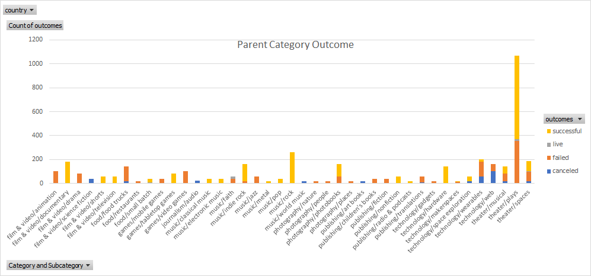
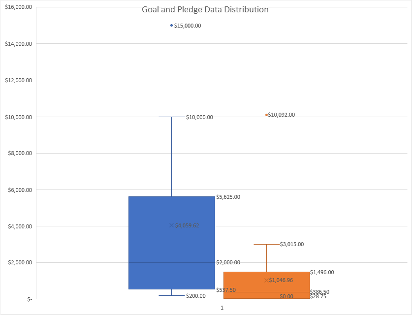
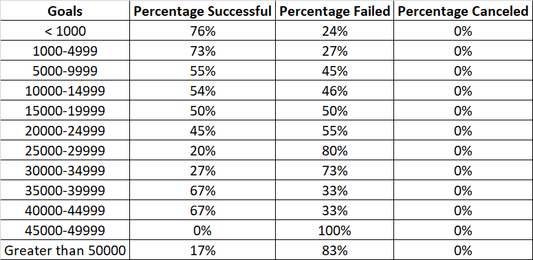
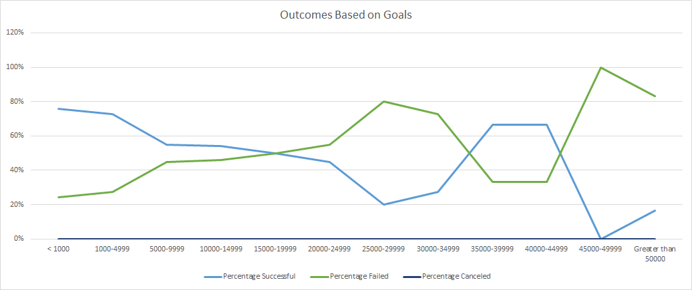

# An Analysis of Kickstarter Campaigns
performing analysis on Kickstarter data to uncover trends.Following are some of the key finidngs of the analysis:

1. We have found that there were 525 successful theater campaigns in the 
United States.

2. We could also note that play specifically were 412 out 0f 671 which makes the % success rate of them in us to 61.4%

3. For Great Britain the plays specifically were 238 out 0f 314 which makes the % success rate of them in us to 75.8%

4. The Play Category is the most successful out of all categories.

5. looking at the outcomes by launchdate we can note that May is a good time to launch a campaign, whereas October is not so great for campaign launch.

### Parent Category Outcome:

 
From these plots, we can see that the mean campaign goal is around £4,000. This is outside of the range of outliers for amount pledged, so Louise should probably try to get her play produced for less than £4,000. Half of the campaign goals are less than £2,000, which is just over the 3rd quartile for amounts pledged.

### Challange

In an effort to uncover the impact of different variables on a success of a campaign, the attached "_Challange-KicKstarter_" sheet contains a detailed analysis of campaign outcomes based on its _Goals_ and _Launch Dates_.

 The analysis highlights that 74% campaigns were successful which had a goal amount of less than 5000. So less than and equal to 5000$ is a good amount of Goal to have.

 The next best range of goal ammount is of 35000-45000$ with a percentage success of 67%.

	Campaigns having a similar goal range as Louis’s (10000-12000$) have a percentage success of 54%.

	At goal amount of 45000 or more seems to be a bad idea as there is a steep dive in the percentage of success at that point and percentage failed hikes up to 100%.

.png)

	May seems to be the best month to launch a campaign followed by June and then July.

	October seems to be a bad month to launch a campaign as it has the highest number of failed projects.

#### Limitations & Suggestions

	Data is dated. The dates of campaigns launched and ended is of 2017 and before.

 Data does not contain all important variables that may have an impact on a campaigns success like (external economic environment,incentives provided, marketing and pr efforst etc). 

	Data does not take into account the impact of current pandemic(covid-19) and its negative impact on the future of theater/play.

For a deeper analysis we should also consider exploring the following:

	Possible link between genre of play and success of campaign? (stacked bar graph)

	Possible link between incentives and success of campaign?

	Possible link between the length of campaign and percentage of success (outcomes based on duration of campaign Pivot chart and line graph)

	Identifying Outliers in the data set (box and whiskers chart for goal and pledged amount)

	Possible link between promotion of campaigns and percentage of success (marketing /social media engagement)

	Possible link between reputation of a campaign owner and its impact on the success and failure. (established person or a celebrity vs a beginner)

	 The Goal and pledged amounts are in a variety of currencies and 5000$ is not equal to 5000 pound and so on, we should probably convert them in one to have an accurate account of success by goal amount.
